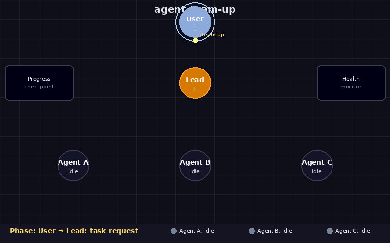
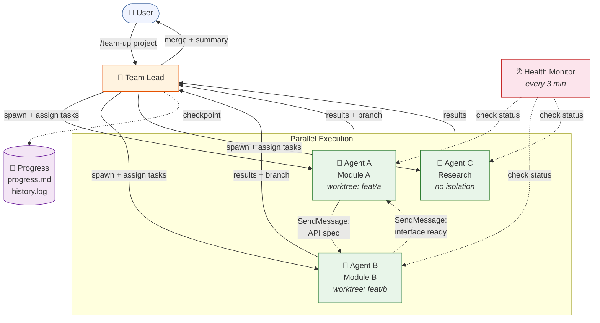
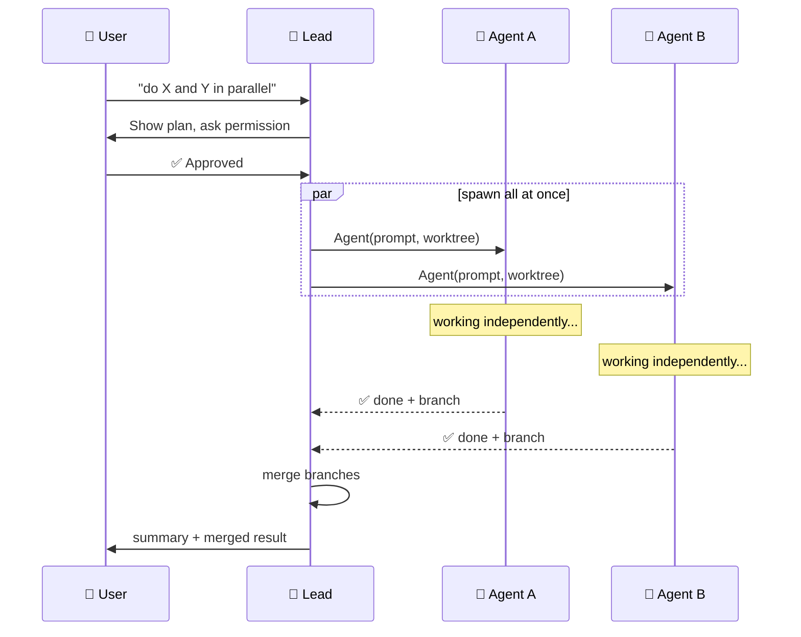
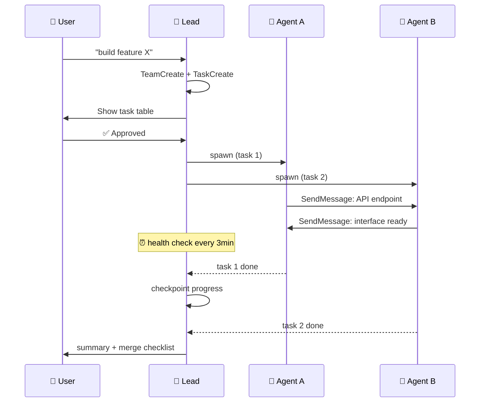
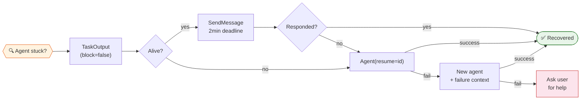

# agent-team-up

A skill for spawning and coordinating multi-agent teams for parallel work. Built for [Claude Code](https://claude.ai/code), designed to be agent-platform agnostic in the future.

<p align="center">
  
</p>

## How It Works



## Subagent Mode vs Team Mode

<table>
<tr><td>

**Subagent Mode** — lightweight, spawn & collect



</td><td>

**Team Mode** — full orchestration



</td></tr>
</table>

## Error Recovery Flow



## Features

- **Two execution modes** — choose the right level of orchestration for your task
- **Worktree isolation** — each agent gets its own copy of the repo, including multi-repo support
- **Health monitoring** — periodic cron-based checks + dead agent detection
- **Progress checkpointing** — persistent state that survives crashes and restarts
- **Auto error recovery** — resume → retry with context → escalate to user
- **Peer messaging** — agents exchange data directly, decisions go through the lead
- **Ghost agent prevention** — mandatory cleanup before spawning replacements
- **Display modes** — split-pane (default with tmux) or in-process, with direct teammate interaction via keyboard shortcuts
- **Quality gate hooks** — enforce linting, tests, or coverage checks when teammates finish tasks
- **Self-claiming tasks** — agents autonomously pick up the next matching task after completing their assignment

## Official Docs vs Our Innovations

This skill fully implements the guidance from the [official Claude Code Agent Teams documentation](https://code.claude.com/docs/en/agent-teams), and adds significant innovations on top.

### Implemented from Official Docs

| Feature | Description |
|---------|-------------|
| Team & Task API | `TeamCreate`, `TaskCreate`, `TaskUpdate`, `TaskList` for structured orchestration |
| Agent spawning | `Agent()` with `team_name`, `isolation: "worktree"`, `mode`, `run_in_background` |
| Inter-agent messaging | `SendMessage` for direct teammate communication |
| Display modes | `teammateMode`: split-pane (default with tmux) vs in-process |
| Direct teammate interaction | Keyboard shortcuts (Shift+Down, Enter, Escape, Ctrl+T) in split-pane mode |
| Self-claiming tasks | Agents pick up next unassigned, unblocked task after completing their assignment |
| Quality gate hooks | `TeammateIdle` / `TaskCompleted` hooks to enforce tests and linting |
| Known limitations | 8 official limitations documented (agent count, context windows, ephemeral state, etc.) |
| Feature flag | `CLAUDE_CODE_EXPERIMENTAL_AGENT_TEAMS` environment variable |

### Our Best Practices & Innovations (Beyond Official Docs)

The official docs provide **what tools are available** (API reference), but not **how to use them well**. We fill that gap with battle-tested best practices and structural innovations:

#### Workflow & Architecture

| Best Practice | What the official docs lack |
|---------------|----------------------------|
| **Subagent Mode** | Official docs only describe Team mode. We add a lightweight alternative — no TeamCreate/TaskCreate overhead for simple parallel tasks. Includes when-to-use decision framework. |
| **T0–T8 step-by-step workflow** | Official docs list APIs; we provide a sequenced playbook: preflight → create team → spawn → environment → monitor → recover → checkpoint → summarize → shutdown. |
| **User permission rule** | Official docs don't mention user consent. We mandate asking the user before spawning or shutting down any agent. |
| **Permission mode guide** | Official docs list modes but don't recommend. We compare `auto`/`plan`/`dontAsk`/`default`/`bypassPermissions` with clear recommendations: `auto` as default, `dontAsk` + worktree for max speed. |

#### Reliability & Recovery

| Best Practice | What the official docs lack |
|---------------|----------------------------|
| **Auto error recovery** | No recovery protocol in official docs. We provide 3-tier escalation: `Agent(resume=id)` → new agent with failure context → ask user. |
| **Ghost agent prevention** | Official docs don't address replacement safety. We enforce 5-step cleanup (save work → close old agent → update progress → handle worktree → THEN replace) before spawning replacements. |
| **"Check alive FIRST" protocol** | Official docs don't warn about messaging dead agents. We mandate `TaskOutput(block=false)` before any `SendMessage` — prevents infinite waits. |
| **Health monitoring** | Official docs mention `TaskOutput` but provide no monitoring strategy. We add `CronCreate` periodic checks (every 3 min) + stuck agent detection criteria. |
| **Progress checkpointing** | Official docs don't address crash recovery. We add persistent `.claude/teams/{name}/` directory with `progress.md`, `history.log`, `results/` — new agents pick up where things stopped. |
| **Structured shutdown** | Official docs don't describe shutdown. We provide normal (summary → checkpoint → confirm → graceful shutdown → cleanup) and emergency protocols. |

#### Agent Coordination

| Best Practice | What the official docs lack |
|---------------|----------------------------|
| **Role-constrained self-claim** | Official docs say "self-claim" but don't address scope creep. We add: only within your role + file locking to prevent races. |
| **Peer messaging rules** | Official docs mention `SendMessage` but not when to use it. We define: factual data → direct to peer; scope changes → through lead. |
| **Multi-repo worktree isolation** | Official docs don't mention multi-repo. `isolation: "worktree"` only covers the startup repo — we add explicit `git worktree` setup for every additional repo. |
| **Environment setup checklist** | Official docs note child agents don't inherit env, but don't provide a checklist. We list all required setup: venv, env vars, PATH, working dir, build commands, system tools. |

#### Developer Experience

| Best Practice | What the official docs lack |
|---------------|----------------------------|
| **Bilingual prompt template** | Ready-to-use EN+CN template with environment setup, teammate info, escalation guidance, and "If You Get Stuck" section. |
| **Troubleshooting guide** | 13 solved problems with root cause analysis, bilingual (EN + CN). Covers: startup failures, race conditions, ghost agents, scope creep, and more. |

## Modes

| | Subagent Mode | Team Mode |
|---|---|---|
| **Best for** | Independent parallel tasks — research, parallel bug fixes, "do A and B simultaneously" | Complex coordination — task dependencies, agents sharing interfaces, long-running projects |
| **Overhead** | Low — spawn and collect | High — task tracking, cron monitoring, progress files |
| **Communication** | Agents return results to lead only | Agents message each other + lead |
| **Monitoring** | Automatic notifications when done | CronCreate health checks + TaskOutput + SendMessage |

**Default to Subagent mode** unless the task clearly needs inter-agent coordination.

## Installation

```bash
# Clone into your Claude Code skills directory
git clone https://github.com/dirkxie/agent-team-up.git ~/.claude/skills/team-up
```

Or copy the files manually into `~/.claude/skills/team-up/`.

## Usage

Invoke manually:

```
/team-up my-project
```

Or Claude will automatically invoke it when you mention teams, agents, swarms, parallel work, or multi-agent coordination.

## Files

| File | Purpose |
|------|---------|
| `SKILL.md` | Main instructions (loaded into context when skill is invoked) |
| `prompt-template.md` | Ready-to-use template for agent prompts with escalation guidance |
| `TROUBLESHOOTING.md` | Common problems and solutions (English + 中文) |

## Quick Start

### Subagent Mode (lightweight)

```python
# 1. Spawn all agents in one message
Agent(name="agent-a", prompt="...", isolation="worktree",
      mode="auto", run_in_background=True)
Agent(name="agent-b", prompt="...",
      mode="auto", run_in_background=True)

# 2. Wait — you'll be notified as each finishes

# 3. Synthesize results + merge branches
# git merge <branch> && git worktree remove <path>
```

### Team Mode (full orchestration)

```python
# 1. Create team + progress directory
TeamCreate(team_name="proj-x", description="...")
# mkdir -p .claude/teams/proj-x/results

# 2. Create tasks with dependencies
TaskCreate(subject="Module A", description="...")  # → id: 1
TaskCreate(subject="Module B", description="...")  # → id: 2
TaskUpdate(taskId="3", addBlockedBy=["1", "2"])

# 3. Assign BEFORE spawning
TaskUpdate(taskId="1", owner="agent-a")

# 4. Spawn agents (after user approval)
Agent(name="agent-a", team_name="proj-x", isolation="worktree",
      mode="auto", run_in_background=True, prompt="...task ID: 1...")

# 5. Monitor with CronCreate health checks

# 6. When done: checkpoint → summary → shutdown → cleanup
```

## Key Principles

- **User permission required** — never spawn or shut down agents without explicit approval
- **Pre-assign initial tasks before spawning** — prevents race conditions on startup
- **Environment setup is explicit** — child agents don't inherit the parent's environment
- **Agents self-claim within role** — finished agents pick up the next unassigned, unblocked task matching their role; if none remain, they report to lead and stop
- **Quality gates via hooks** — enforce automated checks (tests, linting) when teammates complete tasks
- **Check alive before messaging** — don't send messages to dead agents
- **Known limitations** — be aware of agent count limits, per-agent context windows, and ephemeral team state

## Troubleshooting

See [TROUBLESHOOTING.md](TROUBLESHOOTING.md) for 13 solved problems with detailed root cause analysis and fixes (English + 中文).

---

# agent-team-up（中文）

一个用于启动和协调多 agent 团队并行工作的 skill。当前适配 [Claude Code](https://claude.ai/code)，未来计划支持更多 agent 平台。

## 功能特性

- **双模式执行** — 根据任务复杂度选择轻量或完整编排模式
- **Worktree 隔离** — 每个 agent 获得独立的代码副本，支持多 repo 隔离
- **健康监控** — 基于 cron 的定期检查 + 死亡 agent 检测
- **进度持久化** — 崩溃重启后不丢失进度
- **自动错误恢复** — resume → 带上下文重试 → 升级到用户
- **Peer 通讯** — agent 之间直接交换数据，决策通过 lead
- **幽灵 agent 防护** — 替换前强制清理旧 agent
- **显示模式** — 分屏（tmux 下默认）或进程内，支持键盘快捷键直接与队友交互
- **质量门禁** — 通过 hooks 在队友完成任务时自动执行 lint、测试或覆盖率检查
- **任务自行领取** — agent 完成当前任务后自动领取下一个匹配其角色的可用任务

## 官方文档 vs 我们的创新

本 skill 完整实现了 [Claude Code Agent Teams 官方文档](https://code.claude.com/docs/en/agent-teams) 中的指导意见，并在此基础上做了大量创新。

### 已实现的官方功能

| 功能 | 说明 |
|------|------|
| Team & Task API | `TeamCreate`、`TaskCreate`、`TaskUpdate`、`TaskList` 结构化编排 |
| Agent 启动 | `Agent()` 支持 `team_name`、`isolation: "worktree"`、`mode`、`run_in_background` |
| Agent 间通讯 | `SendMessage` 直接队友通讯 |
| 显示模式 | `teammateMode`：分屏（tmux 下默认）vs 进程内 |
| 直接与队友交互 | 分屏模式下键盘快捷键（Shift+Down、Enter、Escape、Ctrl+T） |
| 任务自行领取 | Agent 完成任务后自动领取下一个匹配的未分配任务 |
| 质量门禁 | `TeammateIdle` / `TaskCompleted` hooks 自动执行测试和 lint |
| 已知限制 | 8 条官方限制（agent 数量、上下文窗口、临时状态等） |
| 功能开关 | `CLAUDE_CODE_EXPERIMENTAL_AGENT_TEAMS` 环境变量 |

### 我们的最佳实践与创新（超越官方文档）

官方文档提供的是**有哪些工具**（API 参考），但没有告诉你**怎么用好**。我们用实战验证过的最佳实践填补了这个空白：

#### 工作流与架构

| 最佳实践 | 官方文档缺少什么 |
|----------|-----------------|
| **Subagent 模式** | 官方只描述 Team 模式。我们加了轻量替代方案——简单并行任务无需 TeamCreate/TaskCreate 开销，并提供选择决策框架。 |
| **T0–T8 分步工作流** | 官方列出 API；我们提供完整的执行剧本：预检 → 建团队 → 启动 → 环境 → 监控 → 恢复 → 存档 → 汇总 → 关闭。 |
| **用户许可规则** | 官方未提及用户同意。我们要求启动或关闭任何 agent 前必须征得用户同意。 |
| **权限模式指南** | 官方列出模式但不推荐。我们对比 `auto`/`plan`/`dontAsk`/`default`/`bypassPermissions` 并给出建议：`auto` 为默认，`dontAsk` + worktree 最快。 |

#### 可靠性与故障恢复

| 最佳实践 | 官方文档缺少什么 |
|----------|-----------------|
| **自动错误恢复** | 官方无恢复协议。我们提供 3 级升级：`Agent(resume=id)` → 新 agent + 失败上下文 → 问用户。 |
| **幽灵 agent 防护** | 官方未涉及替换安全。我们强制 5 步清理（保存工作 → 关闭旧 agent → 更新进度 → 处理 worktree → 再替换），防止同一任务两个 agent。 |
| **"先检查存活"协议** | 官方未警告给死掉 agent 发消息的后果。我们要求始终先 `TaskOutput(block=false)` 再 `SendMessage`——防止无限等待。 |
| **健康监控** | 官方提到 `TaskOutput` 但无监控策略。我们加了 `CronCreate` 每 3 分钟检查 + 卡住判定标准。 |
| **进度持久化** | 官方未涉及崩溃恢复。我们加了 `.claude/teams/{name}/` 目录（`progress.md`、`history.log`、`results/`），新 agent 可接续之前的工作。 |
| **结构化关闭协议** | 官方未描述关闭流程。我们提供正常关闭（汇总 → 存档 → 确认 → 优雅关闭 → 清理）和紧急关闭协议。 |

#### Agent 协调

| 最佳实践 | 官方文档缺少什么 |
|----------|-----------------|
| **角色约束的自行领取** | 官方说"自行领取"但未防范越权。我们加了：只能领取匹配角色的任务 + 文件锁防竞争。 |
| **Peer 通讯规则** | 官方提到 `SendMessage` 但未说明何时用。我们定义：事实性数据 → 直接发队友；范围变更 → 通过 lead。 |
| **多 repo worktree 隔离** | 官方未提及多 repo。`isolation: "worktree"` 只覆盖启动 repo——我们为每个额外 repo 添加显式 worktree 配置。 |
| **环境配置清单** | 官方提到子 agent 不继承环境，但未提供清单。我们列出所有必需配置：venv、环境变量、PATH、工作目录、构建命令、系统工具。 |

#### 开发者体验

| 最佳实践 | 官方文档缺少什么 |
|----------|-----------------|
| **双语 prompt 模板** | 现成的中英文模板，包含环境配置、队友信息、升级指引和"卡住时怎么办"段落。 |
| **问题排查指南** | 13 个已解决问题，含根因分析，中英双语。覆盖：启动失败、竞态条件、幽灵 agent、越权等。 |

## 使用场景

- 需要多个 agent 同时处理一个任务的不同部分
- 任务过于庞大，单个 agent 难以完成，需要并行执行
- 需要结构化协调：任务依赖、worktree 隔离、权限管理
- Agent 需要跨多个 repo 修改文件
- 需要韧性保障：自动检测卡住的 agent、故障恢复、进度持久化

## 安装

```bash
# 克隆到 Claude Code skills 目录
git clone https://github.com/dirkxie/agent-team-up.git ~/.claude/skills/team-up
```

或手动复制文件到 `~/.claude/skills/team-up/`。

## 调用方式

手动调用：
```
/team-up my-project
```

或者当你要求 Claude 启动 agent 团队、创建集群、协调并行任务时，Claude 会自动调用此 skill。

## 文件说明

| 文件 | 用途 |
|------|------|
| `SKILL.md` | 主指令文件（skill 被调用时加载到上下文） |
| `prompt-template.md` | Agent prompt 模板，包含 "卡住时上报" 指引 |
| `TROUBLESHOOTING.md` | 常见问题与解决方案（英文 + 中文） |

## 问题排查

参见 [TROUBLESHOOTING.md](TROUBLESHOOTING.md)，包含 13 个已解决问题的详细根因分析和修复方案。

## License

[MIT](LICENSE)
