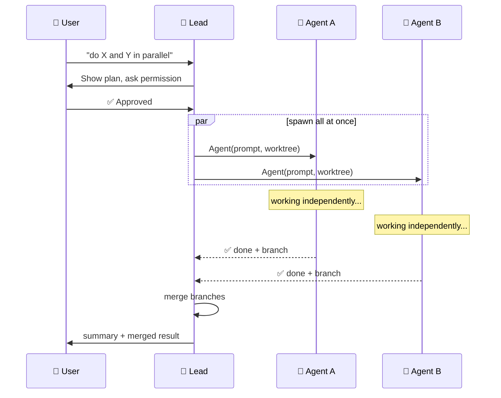
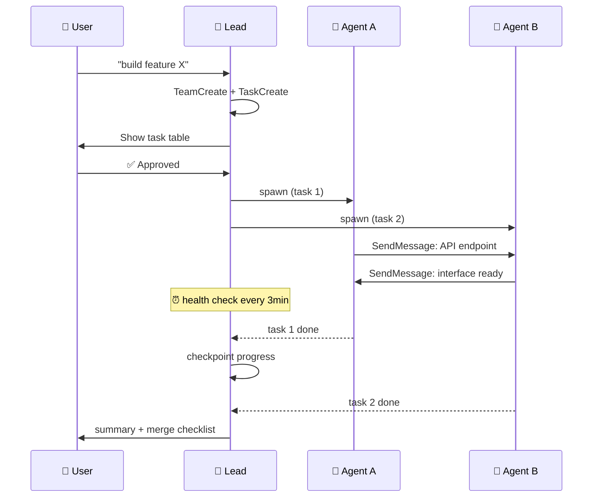

# agent-team-up

A skill for spawning and coordinating multi-agent teams for parallel work. Built for [Claude Code](https://claude.ai/code), designed to be agent-platform agnostic in the future.

<p align="center">
  
</p>

## How It Works


## Subagent Mode vs Team Mode

<table>
<tr><td>

**Subagent Mode** — lightweight, spawn & collect



</td><td>

**Team Mode** — full orchestration



</td></tr>
</table>

## Error Recovery Flow


## Features

- **Two execution modes** — choose the right level of orchestration for your task
- **Worktree isolation** — each agent gets its own copy of the repo, including multi-repo support
- **Health monitoring** — periodic cron-based checks + dead agent detection
- **Progress checkpointing** — persistent state that survives crashes and restarts
- **Auto error recovery** — resume → retry with context → escalate to user
- **Peer messaging** — agents exchange data directly, decisions go through the lead
- **Ghost agent prevention** — mandatory cleanup before spawning replacements

## Modes

| | Subagent Mode | Team Mode |
|---|---|---|
| **Best for** | Independent parallel tasks — research, parallel bug fixes, "do A and B simultaneously" | Complex coordination — task dependencies, agents sharing interfaces, long-running projects |
| **Overhead** | Low — spawn and collect | High — task tracking, cron monitoring, progress files |
| **Communication** | Agents return results to lead only | Agents message each other + lead |
| **Monitoring** | Automatic notifications when done | CronCreate health checks + TaskOutput + SendMessage |

**Default to Subagent mode** unless the task clearly needs inter-agent coordination.

## Installation

```bash
# Clone into your Claude Code skills directory
git clone https://github.com/dirkxie/agent-team-up.git ~/.claude/skills/team-up
```

Or copy the files manually into `~/.claude/skills/team-up/`.

## Usage

Invoke manually:

```
/team-up my-project
```

Or Claude will automatically invoke it when you mention teams, agents, swarms, parallel work, or multi-agent coordination.

## Files

| File | Purpose |
|------|---------|
| `SKILL.md` | Main instructions (loaded into context when skill is invoked) |
| `prompt-template.md` | Ready-to-use template for agent prompts with escalation guidance |
| `TROUBLESHOOTING.md` | Common problems and solutions (English + 中文) |

## Quick Start

### Subagent Mode (lightweight)

```python
# 1. Spawn all agents in one message
Agent(name="agent-a", prompt="...", isolation="worktree",
      mode="auto", run_in_background=True)
Agent(name="agent-b", prompt="...",
      mode="auto", run_in_background=True)

# 2. Wait — you'll be notified as each finishes

# 3. Synthesize results + merge branches
# git merge <branch> && git worktree remove <path>
```

### Team Mode (full orchestration)

```python
# 1. Create team + progress directory
TeamCreate(team_name="proj-x", description="...")
# mkdir -p .claude/teams/proj-x/results

# 2. Create tasks with dependencies
TaskCreate(subject="Module A", description="...")  # → id: 1
TaskCreate(subject="Module B", description="...")  # → id: 2
TaskUpdate(taskId="3", addBlockedBy=["1", "2"])

# 3. Assign BEFORE spawning
TaskUpdate(taskId="1", owner="agent-a")

# 4. Spawn agents (after user approval)
Agent(name="agent-a", team_name="proj-x", isolation="worktree",
      mode="auto", run_in_background=True, prompt="...task ID: 1...")

# 5. Monitor with CronCreate health checks

# 6. When done: checkpoint → summary → shutdown → cleanup
```

## Key Principles

- **User permission required** — never spawn or shut down agents without explicit approval
- **Assign tasks before spawning** — prevents race conditions
- **Environment setup is explicit** — child agents don't inherit the parent's environment
- **Agents stay in scope** — finished agents report to lead and stop, they don't self-assign
- **Check alive before messaging** — don't send messages to dead agents

## Troubleshooting

See [TROUBLESHOOTING.md](TROUBLESHOOTING.md) for 13 solved problems with detailed root cause analysis and fixes (English + 中文).

---

# agent-team-up（中文）

一个用于启动和协调多 agent 团队并行工作的 skill。当前适配 [Claude Code](https://claude.ai/code)，未来计划支持更多 agent 平台。

## 功能特性

- **双模式执行** — 根据任务复杂度选择轻量或完整编排模式
- **Worktree 隔离** — 每个 agent 获得独立的代码副本，支持多 repo 隔离
- **健康监控** — 基于 cron 的定期检查 + 死亡 agent 检测
- **进度持久化** — 崩溃重启后不丢失进度
- **自动错误恢复** — resume → 带上下文重试 → 升级到用户
- **Peer 通讯** — agent 之间直接交换数据，决策通过 lead
- **幽灵 agent 防护** — 替换前强制清理旧 agent

## 使用场景

- 需要多个 agent 同时处理一个任务的不同部分
- 任务过于庞大，单个 agent 难以完成，需要并行执行
- 需要结构化协调：任务依赖、worktree 隔离、权限管理
- Agent 需要跨多个 repo 修改文件
- 需要韧性保障：自动检测卡住的 agent、故障恢复、进度持久化

## 安装

```bash
# 克隆到 Claude Code skills 目录
git clone https://github.com/dirkxie/agent-team-up.git ~/.claude/skills/team-up
```

或手动复制文件到 `~/.claude/skills/team-up/`。

## 调用方式

手动调用：
```
/team-up my-project
```

或者当你要求 Claude 启动 agent 团队、创建集群、协调并行任务时，Claude 会自动调用此 skill。

## 文件说明

| 文件 | 用途 |
|------|------|
| `SKILL.md` | 主指令文件（skill 被调用时加载到上下文） |
| `prompt-template.md` | Agent prompt 模板，包含 "卡住时上报" 指引 |
| `TROUBLESHOOTING.md` | 常见问题与解决方案（英文 + 中文） |

## 问题排查

参见 [TROUBLESHOOTING.md](TROUBLESHOOTING.md)，包含 13 个已解决问题的详细根因分析和修复方案。

## License

[MIT](LICENSE)
